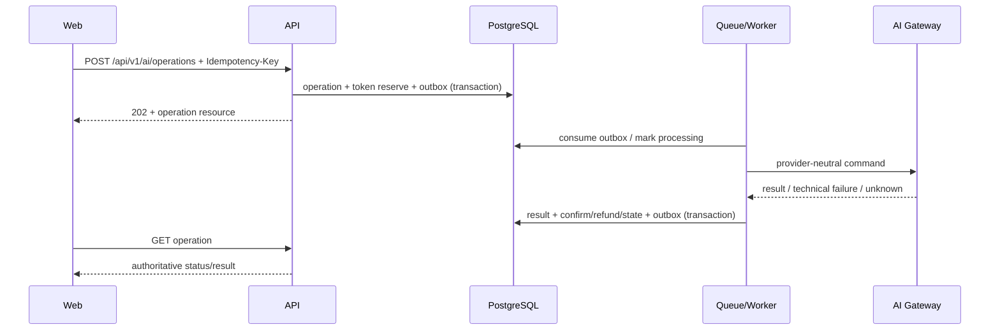

# API-архитектура

API — REST JSON `/api/v1`, OpenAPI является контрактом и источником frontend client types. Next.js не реализует backend. Детали решения — [ADR-007](architecture-decisions/ADR-007-api-style.md).

## Форматы

Одиночный success возвращает resource напрямую. Списки возвращают `items` и непрозрачный `nextCursor`. Ошибка соответствует [error-format.md](../03-api/error-format.md). JSON — camelCase; time — ISO 8601 UTC; деньги/токены — integer.

## Auth и доступ

Cookie session и CSRF описаны в [authentication.md](authentication.md). Все защищённые resource queries scoped пользователем; admin routes требуют permission. Not-found чужого ресурса не подтверждает его существование.

## Идемпотентность

Ключ обязателен для AI, платежей, токенных операций, реферальных наград и ручных admin commands. Ключ scoped actor/operation; сохраняется request hash и result. Иной payload с тем же ключом — `409`.

## AI request flow

`outcomeUnknown` переходит в reconciliation; бесконечный резерв запрещён. Payment webhook проверяется сервером, deduplicates provider event и начисляет токены локальной транзакцией. Referral reward создаёт две ledger-записи атомарно.
