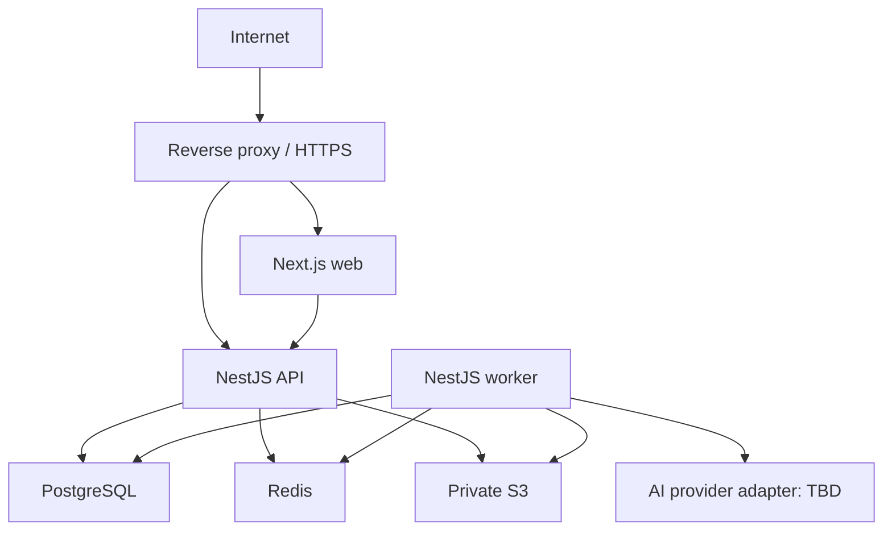

# Архитектура развёртывания

ARCH-001 описывает, но не создаёт инфраструктуру. Решение — [ADR-010](architecture-decisions/ADR-010-deployment.md).

Test использует single server и отдельные Docker containers: reverse proxy, web, API, worker, PostgreSQL, Redis и при self-hosted варианте S3. Внешний S3 допустим. Внутренние порты не публичны; секреты runtime-only.

## Delivery flow

CI: frozen install → lint/typecheck/tests → migration/security/build checks → immutable images с тегом `commit SHA`. Deployment: подтверждение → backup при риске → одноразовая migration → rollout API/worker/web → readiness → smoke. API/worker всегда одного commit SHA.

Application rollback активирует предыдущие образы, совместимые с expand/contract schema. Data restore выполняется runbook. Backup PostgreSQL/S3 шифруется, хранится отдельно и проходит restore drill.

Dockerfiles, compose, pipeline и реальный сервер принадлежат BOOT/deployment-задачам.
