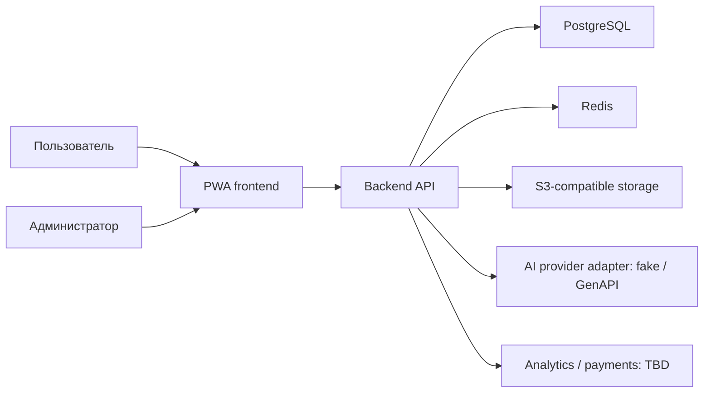

# Обзор системы

## Контекст

Пользователь взаимодействует с PWA. Frontend обращается к backend API. Backend является доверенной границей для авторизации, данных, токенов, рефералов, AI-оркестрации, аналитики и админских операций. Внешние AI, платёжные и аналитические поставщики пока не выбраны.

## Границы ответственности

- Frontend: интерфейс, локальная валидация и отправка разрешённых frontend-событий.
- Backend: аутентификация, авторизация по владельцу, бизнес-инварианты, транзакции, аудит и server-side события.
- PostgreSQL: постоянные структурированные данные и журналы операций.
- Redis: краткоживущий кэш/координация; не источник истины баланса.
- Объектное хранилище: загруженные изображения с приватным доступом.

## Инварианты

Баланс изменяется только транзакционно и не бывает отрицательным. Доступ к пользовательским данным проверяется на backend. AI-провайдер скрыт за адаптером; GenAPI выбран в [ADR-011](architecture-decisions/ADR-011-genapi-ai-provider.md), fake adapter сохраняется для тестов. Подробности — в [доменной модели](../02-domain/domain-model.md) и [security baseline](../05-security/security-baseline.md).
