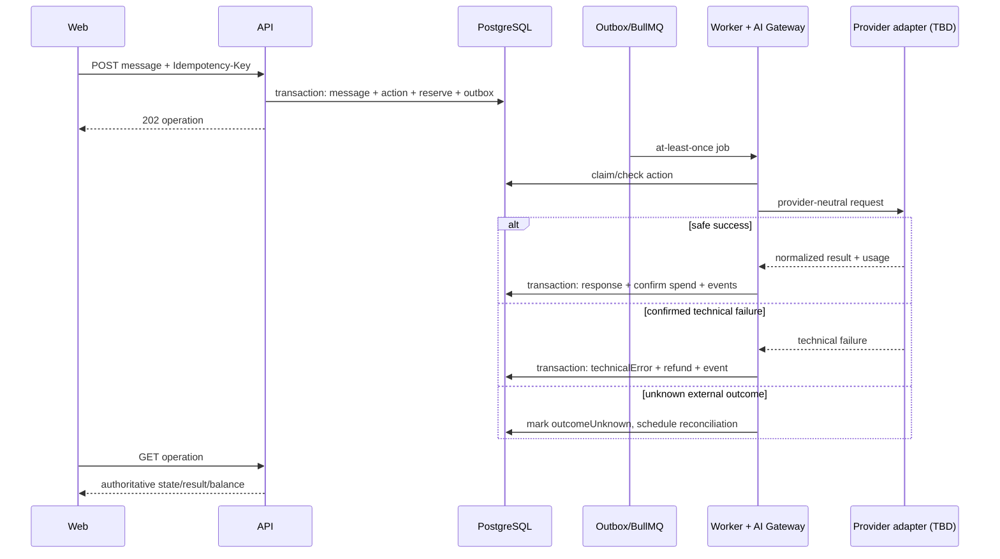

# VERT-001 — первый продуктовый вертикальный срез

## Статус и границы

- Статус: дизайн принят как основа; технические контракты закрыты в VERT-001.1, реализация не начата.
- Цель: провести пользователя от регистрации до оценки первого ответа AI и показать авторитетный токенный баланс.
- Архитектура: без изменений; используются modular monolith, REST, PostgreSQL business truth, transactional outbox, Redis/BullMQ worker и provider-neutral AI Gateway.
- Не входит: password recovery, admin UI, платежи, рефералы, файлы, фото профиля, медицинские функции, streaming, offline-команды и выбор AI-провайдера.

Документ конкретизирует [PRD V1](../../00-product/prd-v1.md), [принятую архитектуру](../system-architecture.md), [архитектуру БД](../database-architecture.md), [API](../api-architecture.md) и [engineering baseline](../engineering-baseline.md). При конфликте источники верхнего уровня имеют приоритет.

## 1. Product flow

### 1.1 Пользовательский путь

```text
registration
→ authenticated session
→ onboarding consent + timezone
→ AI persona selection
→ onboarding completion + 100 starter tokens
→ first weight entry
→ first AI conversation/message
→ token reservation
→ asynchronous AI operation
→ persisted safe response
→ token confirmation or refund
→ authoritative balance
→ like/dislike and optional feedback
```

Пользователь может вернуться на любой завершённый экран. Сервер определяет фактическое состояние; frontend не выводит завершённость из локального состояния и не выполняет optimistic update для веса, AI operation, feedback или токенного баланса.

### 1.2 Состояния пользователя

| Состояние | Серверный критерий | Разрешённый следующий шаг |
|---|---|---|
| `anonymous` | нет действующей session | регистрация или login |
| `registered` | user и session созданы, onboarding не завершён | consent/timezone |
| `profileReady` | обязательные consent и timezone сохранены | выбор persona |
| `personaReady` | действующая AI preference сохранена | завершение onboarding |
| `completed` | onboarding завершён, starter grant подтверждён | ввод веса |
| `weightStarted` | существует первая принадлежащая пользователю weight entry | первый AI-запрос |
| `aiPending` | AI operation `queued`, `processing` или `outcomeUnknown` | polling, безопасный retry только по контракту |
| `aiReady` | operation `succeeded`, ответ сохранён, расход подтверждён | feedback и продолжение диалога |
| `aiFailed` | operation `technicalError`, резерв возвращён | повтор с новым idempotency key |

Это представления состояния, а не отдельная state-machine таблица пользователя. Истина выводится из профильных записей и подтверждённых операций.

### 1.3 Успешный сценарий

1. Пользователь указывает email, пароль, подтверждает возраст 18+ и обязательные согласия.
2. Backend атомарно создаёт identity, credential, consent records и session; cookie устанавливаются только transport-слоем.
3. Пользователь сохраняет timezone и выбирает одну из пяти утверждённых AI-персон.
4. Backend завершает onboarding и в одной транзакции создаёт кошелёк, однократное стартовое начисление 100 токенов и outbox events.
5. Пользователь вводит вес; backend сохраняет запись с ownership и впервые отправляет `first_weight_added`.
6. Пользователь создаёт разговор и отправляет первое текстовое сообщение. До подтверждения видит актуальную цену быстрого ответа — 1 токен по текущей записи `ai_action_prices`.
7. Backend по idempotency key атомарно создаёт AI operation, сообщение пользователя, резерв в ledger и outbox record; возвращает `202 Accepted`.
8. Worker получает повторяемую job, строит минимальный контекст, применяет persona/prompt/safety и вызывает AI provider через port.
9. При пригодном безопасном результате worker в транзакции сохраняет assistant message, подтверждает расход резерва, завершает operation и создаёт outbox events.
10. Frontend polling получает ответ и новый баланс. Пользователь ставит like/dislike и при желании добавляет категорию/комментарий feedback.

### 1.4 Ошибки и edge cases

| Ситуация | Поведение |
|---|---|
| Email уже зарегистрирован | нейтральный `409 EMAIL_ALREADY_REGISTERED`; не раскрывать данные аккаунта сверх факта конфликта регистрации |
| Возраст не подтверждён или младше 18 | регистрация отклоняется, аккаунт не создаётся |
| Обязательное согласие отсутствует | `422 VALIDATION_ERROR`; версии согласий не сохраняются частично |
| Повтор регистрации после потерянного ответа | тот же idempotency key/payload возвращает того же user, отзывает session предыдущего attempt и создаёт новую; другой payload — `409 IDEMPOTENCY_KEY_REUSED` |
| Истёкшая/revoked session | `401 SESSION_INVALID`; refresh следует rotation/reuse rules |
| CSRF/Origin check не пройден | `403 CSRF_VALIDATION_FAILED` без выполнения команды |
| Неподдерживаемая persona | `422 INVALID_PERSONA`; допустимы только пять ID из закрытого словаря |
| Повтор завершения onboarding | возвращается текущее состояние; starter tokens второй раз не начисляются |
| Некорректный вес | `422 VALIDATION_ERROR`; диапазон и точность должны быть утверждены до VERT-001.3 |
| Повтор weight command | idempotency исключает дубликат; `first_weight_added` возникает только один раз |
| Недостаточный баланс | `409 INSUFFICIENT_TOKENS`; operation, message и резерв не создаются |
| Цена изменилась после показа | backend использует текущую цену; при несовпадении ожидаемой цены возвращает `409 AI_ACTION_PRICE_CHANGED` с новой ценой |
| Дублированный AI request | тот же key/payload возвращает ту же operation; другой payload — `409` |
| Provider timeout с подтверждённым отсутствием результата | `technicalError`, полный идемпотентный refund, `ai_response_error` |
| Внешний исход неизвестен | временное `outcomeUnknown`; нет повторного вызова и финализации ledger до reconciliation |
| Unsafe/непригодный ответ | не показывается; классифицируется technical error для токенной экономики и вызывает refund |
| Повтор worker job | проверяет action state; не создаёт второй ответ, расход или refund |
| Feedback к чужому/несуществующему ответу | `404 RESOURCE_NOT_FOUND`; существование чужого объекта не раскрывается |
| Повтор feedback | `PUT` обновляет одну запись; события возникают только после подтверждённого изменения |

## 2. Domain design

### 2.1 Модули и ответственность

| Модуль | Ответственность в срезе | Не отвечает за |
|---|---|---|
| `identity` | registration, credential, sessions, consent evidence, auth context | профиль, токены, AI |
| `profiles` | timezone, onboarding state, AI preference/persona | sessions, prompt execution |
| `tracking` | weight entries и определение первой записи | onboarding и analytics transport |
| `ai-companion` | conversations/messages, AI action lifecycle, Gateway ports, prompt/context/safety orchestration, feedback | цены, ledger и provider-specific SDK в domain/application |
| `token-economy` | wallet, prices, reserve/confirm/refund ledger operations, starter grant | вызов AI и аналитический баланс |
| `analytics` | доставка только зарегистрированных product events из outbox | бизнес-решения и источник баланса |

Composition между модулями выполняют application use cases через публичные application ports. Модуль не импортирует чужие repositories, Drizzle schemas или infrastructure.

### 2.2 Application use cases

- `identity`: `RegisterUser`, `CreateSession`, `RefreshSession`, `RevokeSession`, `GetCurrentSession`.
- `profiles`: `UpdateOnboardingProfile`, `SelectAiPersona`, `CompleteOnboarding`, `GetOnboardingState`.
- `tracking`: `AddWeightEntry`, `ListWeightEntries` (для среза достаточно текущей/первой страницы).
- `token-economy`: `GrantStarterTokens`, `GetWallet`, `GetAiActionPrice`, `ReserveTokens`, `ConfirmTokenSpend`, `RefundTokenReservation`.
- `ai-companion`: `CreateConversation`, `StartAiReply`, `ProcessAiReply`, `ReconcileAiOutcome`, `GetAiOperation`, `GetConversation`, `UpsertAiFeedback`.
- `analytics`: `PublishRegisteredProductEvent` из committed outbox.

`CompleteOnboarding` координирует профиль и starter grant через одну PostgreSQL transaction boundary. `StartAiReply` координирует AI action, token reservation и outbox в одной transaction boundary. Внешний AI-вызов никогда не выполняется внутри DB transaction.

### 2.3 Доменные сущности

Используются ранее определённые `User`, `UserProfile`, `AiPreference`, `WeightEntry`, `AiConversation`, `AiMessage`, `AiFeedback`, `TokenWallet`, `TokenTransaction` и `AiActionPrice`.

Для технически явного lifecycle добавляются концепции:

- **Session** — opaque server-side session family с rotation/reuse detection; часть identity, не новая продуктовая функция.
- **ConsentRecord** — доказательство версии обязательного согласия.
- **AiOperation** — идемпотентная асинхронная операция AI, связывающая input message, цену, reservation и terminal result; её ID используется как `action_id` аналитических событий.
- **OutboxEvent** — инфраструктурная запись доставки внутреннего/аналитического события после commit.

`AiOperation` имеет состояния `queued → processing → succeeded | technicalError`; `outcomeUnknown` — временное reconciliation state, а не terminal outcome. Это согласует архитектурный риск с правилом AI-ошибок о двух терминальных исходах.

## 3. Database design

### 3.1 Предлагаемые таблицы

Точные SQL types и имена enum/check values уточняются в задачах миграций, но приведённые инварианты обязательны.

| Таблица | Минимальные поля | Ключевые ограничения |
|---|---|---|
| `users` | `id`, `email_normalized`, `status`, timestamps | unique normalized email; status check |
| `password_credentials` | `user_id`, `password_hash`, timestamps | PK/FK user; hash никогда не возвращается API |
| `user_sessions` | `id`, `user_id`, `family_id`, `token_hash`, `expires_at`, `rotated_from_id`, `revoked_at`, timestamps | unique token hash; indexes user/family/expiry |
| `user_consents` | `id`, `user_id`, `consent_type`, `document_version`, `accepted_at`, `source` | unique user/type/version; immutable evidence |
| `user_profiles` | `user_id`, `timezone`, `onboarding_status`, `onboarding_completed_at`, timestamps | PK/FK user; IANA timezone validation in application |
| `ai_preferences` | `user_id`, `persona_id`, `strictness`, `response_length`, timestamps | PK/FK user; closed-value checks |
| `weight_entries` | `id`, `user_id`, `weight_value`, `recorded_at`, timestamps | positive bounded numeric; ownership FK |
| `token_wallets` | `id`, `user_id`, timestamps | unique user; wallet не хранит изменяемый authoritative balance |
| `token_transactions` | `id`, `wallet_id`, `type`, `amount`, `status`, `reservation_id`, `source_type`, `source_id`, `idempotency_key`, timestamps | integer amount; unique source/idempotency effects; ledger sum не уходит ниже нуля под lock |
| `ai_action_prices` | `id`, `action_type`, `price_tokens`, `valid_from`, `valid_to`, `enabled`, timestamps | integer `>=1`; не более одной действующей цены на action type |
| `ai_conversations` | `id`, `user_id`, timestamps, optional deletion marker | ownership index; soft delete только по privacy flow |
| `ai_messages` | `id`, `conversation_id`, `role`, `content`, `prompt_version`, timestamps | role check; порядок по conversation/time/id |
| `ai_operations` | `id`, `user_id`, `conversation_id`, `input_message_id`, `output_message_id`, `action_type`, `status`, `price_tokens`, `reservation_id`, `idempotency_key`, `request_hash`, `provider_request_ref`, error metadata, timestamps | unique user/idempotency key; state and ownership checks |
| `ai_feedback` | `id`, `user_id`, `message_id`, `rating`, `category`, `comment`, timestamps | unique user/message; rating closed set; assistant messages only in application |
| `outbox_messages` | `id`, `event_name`, `event_version`, minimal payload, `occurred_at`, `available_at`, `attempts`, `processed_at`, error metadata | index unprocessed/available; stable event ID |

`nutrition_profiles` не создаётся в этом срезе: flow не собирает пищевые предпочтения. Общая доменная сущность остаётся в V1 и появится вместе с требующим её сценарием.

### 3.2 Связи и ownership

- `users` владеет profile, preference, sessions, consents, weight entries, wallet, conversations, actions и feedback.
- `ai_conversations.user_id` является корнем ownership; message/action queries всё равно включают `user_id` через join/denormalized owner predicate.
- `ai_operations.reservation_id` ссылается на уникальный reservation effect в ledger.
- `ai_operations.output_message_id` заполняется только при `succeeded`.
- Outbox payload содержит opaque IDs и минимальные event parameters; тексты AI, точный вес, email, cookies и password data запрещены.

### 3.3 Критические индексы и constraints

- `uq_users_email_normalized`.
- `uq_user_sessions_token_hash`, `idx_user_sessions_user_id`, `idx_user_sessions_family_id`, `idx_user_sessions_expires_at`.
- `uq_token_wallets_user_id`.
- `uq_token_transactions_source_effect` и `uq_token_transactions_idempotency`.
- `idx_token_transactions_wallet_id_created_at`.
- `uq_ai_operations_user_id_idempotency_key`, `idx_ai_operations_status_created_at`.
- `idx_weight_entries_user_id_recorded_at`.
- `idx_ai_conversations_user_id_created_at`, `idx_ai_messages_conversation_id_created_at`.
- `uq_ai_feedback_user_id_message_id`.
- `idx_outbox_messages_pending` по `processed_at/available_at`.

Ledger mutation выполняется под row lock кошелька/согласованной aggregate row и проверяет новый баланс в той же транзакции. Аналитика и Redis не участвуют в расчёте баланса. Реализация может выбрать вычисляемую сумму ledger или транзакционно поддерживаемый snapshot, но snapshot не заменяет ledger и требует отдельного проверяемого инварианта в VERT-001.4.

### 3.4 Решения VERT-001.4 перед миграциями

- Вес: 20.0–500.0 кг включительно, не более одного знака после запятой; PostgreSQL `numeric`, не float.
- Закрытые ID persona, strictness и response length; для первого среза UI может использовать безопасные defaults strictness/length без отдельной настройки.
- Версии и тексты обязательных consent documents.
- Retention/redaction полей `provider_request_ref` и error metadata.
- Balance snapshot не используется: доступный баланс вычисляется из immutable ledger. HTTP idempotency хранит owner, operation scope, key, canonical payload hash, lifecycle и сохранённый HTTP response.

## 4. API design

Все пути имеют префикс `/api/v1`, JSON использует camelCase, время — ISO 8601 UTC. Защищённые cookie-команды требуют CSRF и Origin/Referer validation. Ошибки используют [единый envelope](../../03-api/error-format.md).

### 4.1 Endpoints

| Метод и путь | Назначение | Ответ | Idempotency |
|---|---|---|---|
| `POST /registrations` | регистрация, consent evidence, initial session | `201` user/onboarding summary + cookies | required |
| `POST /sessions` | login | `201` session summary + cookies | не требуется |
| `POST /sessions/refreshes` | refresh rotation | `201` session summary + rotated cookies | token rotation защищает повтор |
| `DELETE /sessions/current` | logout | `204` | naturally idempotent |
| `GET /users/me` | current identity | `200` user/onboarding summary | read |
| `GET /users/me/onboarding` | authoritative onboarding state | `200` | read |
| `PATCH /users/me/profile` | timezone и разрешённые onboarding fields | `200` profile | recommended |
| `PUT /users/me/ai-preference` | выбор persona | `200` preference | natural resource idempotency |
| `POST /users/me/onboarding-completions` | завершение + starter grant | `201` completion/wallet summary | required |
| `POST /weight-entries` | создать или обновить актуальный вес за локальную дату пользователя | `201` weight entry + `result=created\|updated` | required |
| `GET /weight-entries?limit=&cursor=` | принадлежащая пользователю история актуальных дневных значений | `200` cursor page | read |
| `GET /ai-action-prices/quick-reply` | текущая цена до подтверждения | `200` price/version | read |
| `POST /ai-conversations` | создать разговор | `201` conversation | required |
| `POST /ai/operations` | сохранить user message, reserve, запустить reply | `202` operation resource | required |
| `GET /ai/operations/{operationId}` | polling AI operation | `200` status/result link/balance when final | read + ownership |
| `GET /ai-conversations/{conversationId}` | conversation/messages | `200` | read + ownership |
| `GET /token-wallets/current` | authoritative balance и краткая история | `200` | read |
| `PUT /ai-messages/{messageId}/feedback` | like/dislike и optional feedback | `200` feedback | natural resource idempotency |

### 4.2 Ключевые payload

Registration request содержит email, password, `ageConfirmed`, timezone при наличии и массив `{consentType, documentVersion, accepted}`. Ответ не содержит hashes/secrets и возвращает `userId`, onboarding state и CSRF bootstrap contract.

AI message request:

```json
{
  "conversationId": "opaque-conversation-id",
  "content": "Текст пользователя",
  "actionType": "quickReply",
  "expectedPriceTokens": 1,
  "priceVersion": "opaque-version"
}
```

Header `Idempotency-Key` обязателен. `202` возвращает:

```json
{
  "id": "opaque-operation-id",
  "status": "queued",
  "pollUrl": "/api/v1/ai/operations/opaque-operation-id"
}
```

Operation никогда не раскрывает provider/model internals. Финальный success содержит ссылки/ID сообщения и подтверждённый `balance`; technical error содержит безопасный error code и подтверждённый refunded balance. `outcomeUnknown` сообщает только, что результат уточняется и повтор команды пока запрещён.

### 4.3 Ошибки

Минимальный словарь: `VALIDATION_ERROR` (422), `AUTHENTICATION_FAILED` (401), `SESSION_INVALID` (401), `CSRF_VALIDATION_FAILED` (403), `RESOURCE_NOT_FOUND` (404), `EMAIL_ALREADY_REGISTERED` (409), `IDEMPOTENCY_KEY_REUSED` (409), `ONBOARDING_INCOMPLETE` (409), `INVALID_PERSONA` (422), `INSUFFICIENT_TOKENS` (409), `AI_ACTION_PRICE_CHANGED` (409), `AI_OPERATION_IN_PROGRESS` (409), `AI_TECHNICAL_ERROR` (502/operation result) и `RATE_LIMITED` (429).

## 5. AI flow

### 5.1 Границы

- Product rules: application/domain модулей profiles, ai-companion и token-economy.
- AI Gateway: orchestration ports, prompt selection, context builder, safety and usage normalization.
- Provider adapter: transport/provider SDK mapping; не знает о wallet, onboarding или analytics.
- Prompt Registry: версионируемые repository artifacts с stable prompt version; provider не выбран.

### 5.2 Контекст первого запроса

Минимальный разрешённый контекст: persona ID и её safety-constrained style, timezone при необходимости формулировки, последнее введённое значение веса только если пользовательский запрос требует этого, текущий conversation input и обязательное wellness/non-medical safety instruction. Email, password/session data, consent evidence, token balance и аналитические IDs в prompt не передаются.

Полный prompt/response не попадает в обычные логи или analytics. Message content хранится в PostgreSQL по privacy policy; usage/cost metadata хранится отдельно от контента.

### 5.3 Последовательность операции



Retry до provider acceptance допускается только по классифицированным transport rules. После возможного принятия provider request автоматический повтор запрещён без provider idempotency/reconciliation evidence. Расходы ограничиваются server-side price/action allowlist, balance reservation, request size/time limits, per-user rate limit и usage/cost records.

## 6. Analytics

Используются только события из [event registry](../../04-analytics/event-registry.md):

| Событие | Момент в срезе | Источник |
|---|---|---|
| `onboarding_started` | первый показ onboarding | frontend |
| `onboarding_step_completed` | сервер принял соответствующий шаг, затем UI фиксирует completion | frontend |
| `ai_persona_selected` | preference сохранена | backend |
| `starter_tokens_added` | однократный grant committed | backend |
| `onboarding_completed` | completion и starter grant committed | backend |
| `first_weight_added` | первая weight entry committed | backend |
| `weight_added` | каждая weight entry committed, включая первую | backend |
| `ai_scenario_opened` | открыт quick reply UI | frontend |
| `ai_request_sent` | action и reservation committed | backend |
| `ai_response_success` | response и confirm committed | backend |
| `ai_response_error` | technicalError и refund committed | backend |
| `tokens_spent` | confirm ledger effect committed | backend |
| `response_liked` / `response_disliked` | feedback rating сохранён | backend |
| `feedback_submitted` | category/comment feedback сохранён | backend |
| `balance_low` / `balance_empty` | подтверждённое ledger изменение пересекло условия реестра | backend |

`onboarding_step_completed.step_id`, `persona_id`, `scenario_id`, feedback category и error class требуют закрытых словарей перед реализацией analytics. Точный вес, email, AI content и feedback comment в события не входят. Доставка backend-событий идёт через outbox at least once с event ID для дедупликации.

## 7. Testing strategy

### 7.1 Unit

- Нормализация email, password policy и registration validation.
- Session rotation, expiry, revocation и reuse detection state transitions.
- Onboarding transition prerequisites и однократность completion.
- Persona allowlist и defaults strictness/length.
- Weight validation и определение первой записи.
- Ledger reserve/confirm/refund, недостаточный баланс, однократный starter grant.
- AI action state machine, error classification и запрет повторного эффекта.
- Prompt/context allowlist и safety output decision.
- Feedback upsert/rating transitions.

### 7.2 Integration с реальными PostgreSQL/Redis

- Constraints email/session/idempotency/starter grant/feedback.
- Concurrent reservations не дают отрицательный баланс.
- Onboarding completion + wallet grant + outbox атомарны.
- AI start + message + reservation + outbox атомарны.
- Повтор API command и worker job не создаёт двойных записей/событий.
- Success подтверждает расход ровно один раз; technical error возвращает полный резерв ровно один раз.
- `outcomeUnknown` не приводит к автоматическому двойному вызову или финализации.
- Ownership predicates скрывают чужие profile, weights, conversations, operations, messages, feedback и wallet.
- Outbox доставляет минимальный payload и корректно проходит retry/dead-letter/reconciliation минимумом V0.1.

### 7.3 Contract и component

- OpenAPI generation и generated client diff check для каждого DTO.
- Error envelope и status codes для позитивных/негативных контрактов.
- Формы registration/onboarding/persona/weight/AI/feedback: validation, loading, retry и accessible labels.
- Polling operation states без optimistic balance/response.
- Service worker не кеширует session, profile, weight, AI, wallet или admin/API responses.

### 7.4 E2E и acceptance

Основной E2E проходит полный flow с deterministic fake provider adapter, доступным только test automation. Отдельные E2E: technical failure/refund, insufficient balance, idempotent retry, expired session, CSRF rejection и cross-user ownership denial.

Для приёмки с реальным AI нужен отдельно выбранный provider adapter; fake provider не является доказательством продуктовой ценности. Test server acceptance подтверждает migration, registration/session, onboarding, persona, first weight, async AI operation, ledger balance, feedback, analytics outbox, health и отсутствие PII/content в логах.

## 8. Acceptance criteria дизайна

- Flow покрывает все восемь шагов VERT-001 без функций вне V1.
- Транзакционные границы starter grant и AI reservation/finalization явны.
- Ledger является единственной бизнес-истиной баланса и защищён от отрицательного значения/дублей.
- AI provider изолирован и не выбран.
- Техническая ошибка возвращает резерв; бизнес-неуспех обрабатывается feedback без автоматического refund.
- Ownership, cookie/CSRF/session security, privacy и event allowlist заданы.
- API и database proposal готовы к декомпозиции, но миграции/код не созданы.
- Открытые продуктовые параметры перечислены и не замаскированы defaults.

## 9. Решения перед реализацией

Пункты 1–5 и 7 конкретизированы в [VERT-001.1 contracts](VERT-001-contracts.md):

1. Onboarding ограничен age/consent/timezone/persona; дополнительные поля не добавлены.
2. Weight хранится в kg exact numeric с диапазоном/точностью контракта.
3. Словари persona/scenario/onboarding/feedback/error зафиксированы.
4. Типы consent зафиксированы; опубликованные version identifiers передаются управляемыми данными.
5. V0.1 использует append-only ledger без balance snapshot и PostgreSQL wallet lock.
6. AI limits, input size, timeout и reconciliation deadline зафиксированы.

Остаются отложенными без блокировки VERT-001.2:

- AI provider/adapter и provider-specific consent до реальной AI-приёмки VERT-001.5;
- recovery channel до включения recovery flow.

Декомпозиция реализации находится в [VERT-001 backlog](../../08-roadmap/vert-001-backlog.md).
